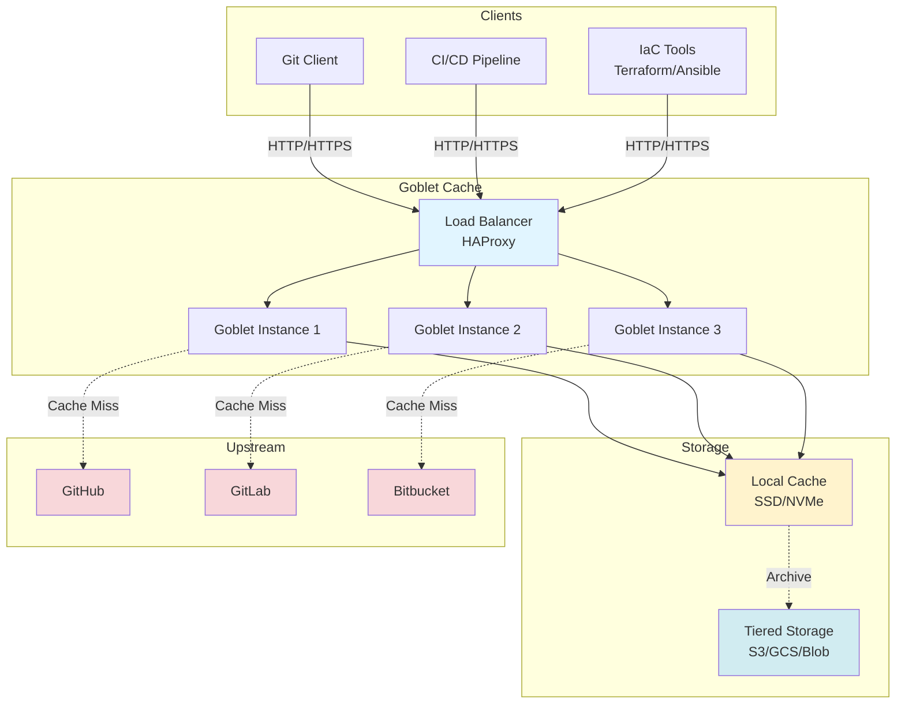

# Goblet: Git caching proxy

[](https://github.com/google/goblet/actions/workflows/ci.yml)
[](docs/index.md)

Goblet is a Git proxy server that caches repositories for read access. It dramatically reduces upstream Git traffic and improves performance for automated tools by serving repeated fetch requests from a local cache.

**Use cases:** CI/CD pipelines, Infrastructure as Code tools (Terraform, Ansible, Pulumi), security scanners, and any service that performs frequent Git operations.

This is not an official Google product (i.e. a 20% project).

## Quick Start

See [Getting Started Guide](docs/getting-started.md) for detailed setup instructions.

```bash
# Run with Docker
docker run -v /path/to/cache:/cache \
  -e UPSTREAM_URL=https://github.com \
  goblet:latest

# Configure git client
git config --global http.proxy http://localhost:8080
```

## Key Benefits

- **5-20x faster** for cached operations
- **80% reduction** in network egress to upstream Git servers
- **Automatic fallback** during upstream outages - serves from cache
- **Multi-tenant ready** with flexible isolation patterns
- **Full observability** with Prometheus metrics

## Architecture



## Security Notice

**IMPORTANT:** Multi-tenant deployments with private repositories require additional security configuration.

**Quick check:**
- **Safe:** Single user per instance, public repos only, or sidecar pattern
- **At Risk:** Multiple users sharing instance with private repos

See [SECURITY.md](SECURITY.md) for immediate actions and [Security Guide](docs/security/README.md) for complete guidance.

## Documentation

**Essential Guides:**
- [Getting Started](docs/getting-started.md) - Setup and first deployment
- [Security Guide](docs/security/README.md) - Multi-tenant security requirements
- [Deployment Patterns](docs/operations/deployment-patterns.md) - Architecture options
- [Offline Mode](docs/operations/offline-mode.md) - Resilience and fallback behavior

**[Complete Documentation Index](docs/index.md)**

## Development

Goblet is designed as a library. This repository includes reference implementation for googlesource.com (see `goblet-server` and `google` directories).

### Testing

```bash
# Run all tests
task test-short

# Run CI pipeline locally
task ci

# Run integration tests (requires Docker)
task test-integration
```

See [testing/TEST_COVERAGE.md](testing/TEST_COVERAGE.md) for detailed test documentation.

### Building

```bash
# Build for current platform
task build

# Build for all platforms
task build-all

# Run locally
task run
```

## How It Works

Goblet intelligently parses Git protocol v2 requests to determine if they can be served from cache. Unlike simple HTTP caching, Goblet understands Git pack-file negotiation and creates appropriate responses based on what the client already has.

When upstream is unavailable, Goblet automatically falls back to serving ref listings from the local cache, enabling continued operation during outages.

See [Architecture Documentation](docs/architecture/) for technical details.

## License

Apache 2.0 - See [LICENSE](LICENSE) for details.

## Contributing

See [CONTRIBUTING.md](CONTRIBUTING.md) for guidelines.
